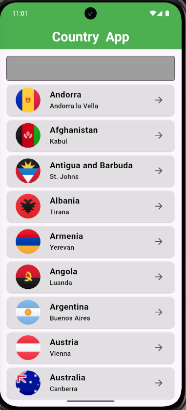
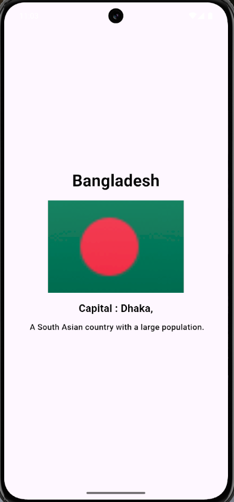

# 🌍 Country App (Flutter + GetX)

A Flutter application that displays a list of countries and detailed information for each country. The app fetches data from an API and uses **GetX** for state management, routing, and dependency injection.

---

## ✨ Features

* 📋 View a list of countries
* 🔍 View detailed information of a selected country
* 🌐 API-based data fetching
* ⚡ Fast and lightweight state management using GetX
* 🧭 Simple and clean UI
* 🔁 Efficient state updates without boilerplate code

---

## 🛠️ Technologies Used

* **Flutter** (UI framework)
* **Dart** (programming language)
* **REST API** (for country data)
* **GetX** (state management, routing, dependency injection)

---

## 📁 Project Structure

```
lib/
│
├── api/
│   └── country_api.dart        # Handles API requests
│
├── getx/
│   └── country_controller.dart # GetX controller for state management
│
├── presentation/
│   ├── screens/
│   │   ├── home_screen.dart    # Country list screen
│   │   └── details_screen.dart # Country details screen
│   │
│   └── widgets/
│       └── country_card.dart   # Reusable UI components
│
├── models/
│   └── country_model.dart      # Country data model
│
├── routes/
│   └── app_routes.dart         # GetX named routes
│
└── main.dart                   # App entry point
```

---

## 🔄 State Management (GetX)

* `GetxController` is used to manage API data and UI state
* `Rx` variables handle reactive updates
* `Obx()` widgets automatically rebuild UI when data changes
* `Get.to()` / `Get.toNamed()` used for navigation

---

## 🌐 API Integration

* Data is fetched from a REST API
* API calls are handled in a separate service file
* Error handling is implemented using `try-catch`
* Loading states are managed using GetX reactive variables

---

## ▶️ How to Run the Project

1. Clone the repository
2. Run `flutter pub get`
3. Connect a device or start an emulator
4. Run `flutter run`

---

## 📸 Screenshots

### 🏳️ Country List Screen



### 📍 Country Details Screen



---

## 📸 Screens Overview

* **Home Screen**: Displays a list of countries
* **Details Screen**: Shows detailed information about the selected country

---

## 🚀 Future Improvements

* 🔎 Search countries
* ⭐ Favorite countries
* 📶 Offline support (cache data)
* 🎨 Improved UI/animations

---

## 👤 Author

**Md Salauddin Rony**
Flutter Developer (Beginner → Junior)

---

## 📄 License

This project is for learning and educational purposes.

---


